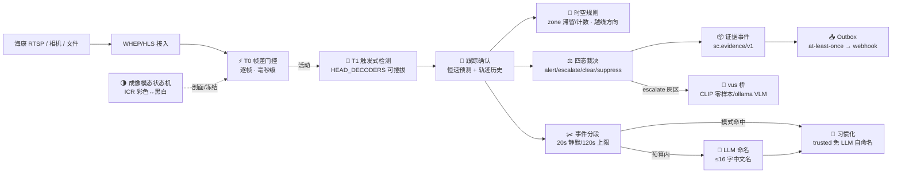

<div align="center">


[**English**](README.md) · 简体中文 · [平台设计](docs/semantic-camera-design.md) · [核心循环 v3](docs/core-loop-v3.md) · [运行时实体关系图](docs/architecture-er.html)

[](https://github.com/CommitStrip/semantic-camera/actions/workflows/ci.yml)
[](LICENSE)
[](https://github.com/CommitStrip/semantic-camera/tags)
[](https://github.com/CommitStrip/semantic-camera/actions)

**预算受控的场所语义事件运行时 · 把摄像头变成可审计的语义事件源**

</div>

---

semantic-camera 把一路实时视频流（海康 RTSP / 手机相机 / 本地视频）变成**端侧实时的场所语义判别与告警**：帧差门控 → 触发式检测 → 跟踪确认 → 四态全自动裁决 → 事件分段 → LLM 命名 → 习惯化。推理全部在浏览器 wasm 完成（**视频不出场**），一切产出是**机器可审计的语义事件**，不是裸视频。本仓是库系主线：`vus` 为通用视频理解引擎，`rvs` 为机器人增量层，前身仓 `anti-drone-monitor`（反无人机单场景演示）已冻结并由此仓继承演进。

## ✨ 核心特性

- **四级速度栈**——T0 帧差门控（逐帧，毫秒级）→ T1 触发式检测（有运动 400ms / 无运动 5s 巡检）→ 跟踪确认（恒速预测 + 分级老化，悬停不丢）→ T1.5 边缘判别。贵的推理只为值得的时刻发生。
- **四态全自动裁决**——`alert` / `escalate`（灰区**弃权不虚报**）/ `clear` / `suppress`；判别路径与检测器权威路径闸门分立（防漏报），**流水线无人工判定环节**。
- **场所模式包**——检测模型 + 判别头 + 规则 + 布防表 + 预算全是**纯数据**（`web/mode-packs.js`），换场所零核心改动；`validatePack` fail-closed，坏配置拒绝布防；**未知模式绝不静默回退**。
- **成像模态状态机**——海康 IR-CUT 彩色↔黑白帧级切换的多信号表决（2of3）+ 振荡防抖 + 分模态参数剖面 + 转换窗学习冻结；合成回放四指标达标。
- **时空规则引擎**——多边形 zone（进区+滞留+占驻计数）与警戒线（越线方向过滤+冷却去重）：规则全是模式包数据，overlay 只读叠加。
- **场景自识别**——不选模式即观察模式（仅记录不虚报）；首个确认事件触发慢脑识别场所，conf≥0.85 自动布防；**人工指定永不自动覆盖**。
- **事件分段与 LLM 命名**——快系统把流切成事件时间段（忙碌场景上限强制切分），慢脑按预算（30 次/时）语义命名；桥断/预算耗尽自动降级模板名，事件流永远可读。
- **习惯化学习**——重复事件模式（上下班画面）draft → model-verified → human-verified 逐级晋升；trusted 命中**直接自命名不调 LLM**，慢脑成本随时间摊销；5% 审计抽检 + admin 金标 + 偏离检测防"习惯性盲区"。
- **可审计证据事件**——`sc.evidence/v1`：稳定事件 ID、双时间戳、配置指纹、模型 sha256、检测/判别置信分立、前因帧环 + 裁剪帧及内容哈希。
- **确定性告警出口**——Outbox（at-least-once + event_id 幂等 + 死信保留）→ webhook（默认脱敏只发元数据）。
- **可插拔检测头**——`HEAD_DECODERS` 注册表：`yolo8head` / `nanodethead`（GFL 分布回归）/ `mock`（确定性时间线）；人员模型 NanoDet-Plus（Apache-2.0，真实街景验证）。
- **预算制成本上限**——检测触发式、仲裁 20 件/时、命名 30 次/时、行为判定独立分账——一切成本有硬上限，不随时长线性增长。

## 🚀 快速开始

```bash
git clone https://github.com/CommitStrip/semantic-camera.git
cd semantic-camera
bash scripts/sync-web.sh                 # assets 模型/运行时 → web/ 本地 staging（clone 后一次）

cd web && python3 -m http.server 8899
# 浏览器打开 http://localhost:8899/index.html
```

- **模式选择**：`?mode=airfield`（净空防黑飞）/ `?mode=restricted-area`（限制区域闯入，NanoDet 人员检测+夜间布防+区域规则）；**不选模式 = 场景自识别**（观察模式仅记录，连桥后自动识别布防）。
- **输入源**：▶ 开始监控（手机相机）/ 📁 视频（本地回放）/ 🔌 海康（RTSP→WHEP 网关，Basic 或查询参数鉴权自动适配）。
- **记录**：遥测面板实时累积，CSV/JSON 导出含检出→裁决→仲裁→命名全链路。

<details>
<summary>🔌 慢脑仲裁桥（可选）：LLM 段命名与行为判定</summary>

灰区案件升级本地慢脑（默认关闭）：

```bash
pip install -r bridge/requirements.txt
cp bridge/config.example.json bridge/config.json   # 填 token 与仲裁器（clip 零样本 / ollama VLM）
python bridge/server.py --config bridge/config.json
# 页面"桥"一栏填 ws://<IP>:8390 + 令牌 → 连接
```

- **命名**：事件段 → LLM 语义命名（"员工上班刷卡进入"），占位名 r1 先上、LLM 覆写 r2（不可变修订）；
- **行为判定**：admin 在模式包定义开放集危险行为（翻墙/偷拍/车祸……= 数据不是代码），敏感区命中即段中判定（P95 ≤15s）；
- **预算**：命名 30 次/时 + 判定独立分账（并发≤2/冷却/队列≤8），桥断即边缘自治，绝不虚报；
- 案件全量归档 JSONL（复训语料）。

</details>

## 🏗️ 工作原理



| 层 | 内容 | 节奏 | 用途 |
|----|------|------|------|
| T0 | 帧差门控 + 成像模态 | 逐帧 | "有没有事发生" + 画面模态 |
| T1 | 触发式检测 + 跟踪 | 400ms/巡检 5s | 谁、在哪、什么轨迹 |
| T1.5 | 边缘判别 + 规则 + 裁决 | 确认目标级 | 该不该报警 |
| T2 | 慢脑命名与仲裁 | 事件段级（预算制） | 事件叫什么、灰区复核 |

两条红线贯穿：**灰区宁可弃权不虚报，判别未出前检测器权威**；一切 LLM 调用走预算（仲裁/命名/判定三本分账）。

## 🏙️ 场所模式包

| 模式包 | 判别任务 | 价值（误报杀手） | 状态 |
|---|---|---|---|
| **airfield 净空防黑飞** | 鸟 / 机（JEPA 判别头） | 鸟群与飘动物不告警，黑飞必报 | ✅ 完整落地 |
| **restricted-area 限制区域闯入** | 人员（NanoDet-Plus@416） | 夜间布防 + 区域滞留 2s 升级 + 越线 | ✅ 真实模型 + zone 规则（真实街景抽帧 7~58 检出/帧） |
| **depot 油库烟火** | 烟 / 雾·晚霞 | 烟火误报是行业第一痛点 | M3 |
| **site 工地合规** | 戴盔 / 未盔 | 人形检测无法区分 | M3 |
| **campus 校园周界** | 人 / 影·物 | 夜间低照度误报抑制 | M3 |
| **farm 养殖驱避** | 鸟 / 兽 / 人 | 分类决定驱避策略 | M5 |

新增场所 = 在 `web/mode-packs.js` 加一条数据（+ 可选模型/判别头文件），**核心零改动**——由 CI 双模式端到端验收与源码洁净度测试强制。

## 📊 性能基准

以下均为实测数值，复现脚本在 `scripts/`。

### 人员模型——真实街景（NanoDet-Plus-m-1.5x@416，Apache-2.0）

| 指标 | 结果 |
|------|------|
| 真实街景检出 | 涩谷十字路口视频（CC BY-SA 4.0）抽帧 **7~58 person/帧**（conf>0.4） |
| 检测时延 | **23-24ms/帧**（Python ORT CPU，416×416） |
| JS 解码等价性 | 与 numpy 参照逐 conf 一致（0.676） |

### 成像模态状态机——合成 ICR 回放（图像域统计合成，真实录像待补）

| 指标 | 结果（目标） |
|------|------|
| 误触发（边界外 begin） | **0**（目标 0） |
| 漏检 | **0**（振荡期按设计抑制 2 处单列） |
| 检测时延 / 稳定时间 | **1.0s / 2.5s**（虚拟采样间隔 500ms） |
| 转换窗假运动 | 软重置全覆盖（begin 伴随率 100%） |

### 协议与链路

| 项 | 结果 |
|----|------|
| WHEP 信令端到端 | ✅ MediaMTX v1.20.0 + H.264（OPTIONS→POST→PATCH→DELETE 全通过）；真实家庭网关探测存活 |
| 段命名/行为判定协议 | ✅ 双往返 E2E（clip 仲裁器诚实弃权）；ollama 命名解析链 mock 全通过（undecidable/JSON 提取/弃权） |
| 探针头离线精度（airfield 判别头） | ✅ 98.15%（162 样本，自前身仓实测继承） |

<details>
<summary>📖 诚实说明与待回填项</summary>

- ICR 回放素材为**合成**（真实昼帧 + 图像域黑白/噪声变换）——非真实 IR-CUT 相机输出，真实录像到位后须复验；
- 浏览器 wasm 端到端帧率/延迟**待回填**（遥测已逐帧采集，导出即实测）；
- ollama 真机命名实测待本机部署 ollama + 视觉模型；
- 真实危险行为判定质量依赖真实场所数据——持续项；
- 审计不一致率（<5%）与 LLM 调用衰减曲线需部署期数据。

</details>

## 📁 仓库结构

```
web/                       浏览器核心（现代浏览器直接打开；不含领域词）
  index.html               流水线编排 + UI（检测/裁决/分段/命名/桥/出口接线）
  core.js                  纯逻辑核心（校验/跟踪/门控/裁决/队列/解码头注册表/
                           区域与规则引擎/模式库/命名门控/修订链/证据事件/桥链路）
  mode-packs.js            场所模式包注册表（纯数据，领域词唯一居所）
  whep-client.js           WHEP 播放器（Basic/查询参数鉴权自适应 + 指数退避）
assets/                    模型/运行时单源（manifest.json 含 sha256/许可证/来源）
bridge/                    vus 慢脑仲裁桥（WS 服务 + CLIP 零样本/ollama 仲裁器
                           + 场景识别/段命名/行为判定 + 案件归档 JSONL）
gateway/                   MediaMTX 网关（海康 RTSP → WHEP/HLS）
scripts/                   staging/资产校验/量化工具/ICR 合成回放/家庭网关验证
docs/                      平台设计（v2.6）/ 核心循环（v3.5）/ 模型选型 / logo / ER 图
tests/                     99 例 node:test（零依赖）
```

## 🤖 Agent 消费

一切产出面向机器消费：**证据事件**（`sc.evidence/v1`）与**命名段**（`sc.segment-label/v1`）经 Outbox/webhook 对外发布，稳定 ID + 不可变修订供 Agent 幂等归并；桥侧 MCP 式协作（查事件/调证据/建工单）为可选出口适配器。运行时实体关系见 [docs/architecture-er.html](docs/architecture-er.html)。

## 💻 硬件资源

无 GPU 依赖，推理全部 wasm CPU。Python 侧选型实测：NanoDet 单帧 23-24ms（桌面 CPU）；wasm 端为秒级——因此检测是**触发式**（门控+冷却）而非逐帧。int8 量化实测结论（前身仓）：现 opset12 导出量化后检出归零，需现代 opset 重导出；校验工具内置任务级闸门防静默失效。

## 🙏 致谢与版权

- [NanoDet-Plus](https://github.com/RangiLyu/nanodet)（Apache-2.0）——人员检测模型（`person-detector.onnx` 为官方 COCO 预训导出，选型与淘汰证据见 [docs/model-selection.md](docs/model-selection.md)）。
- [onnxruntime-web](https://github.com/microsoft/onnxruntime)——wasm 端推理引擎（MIT）。
- [MediaMTX](https://github.com/bluenviron/mediamtx)——RTSP → WebRTC/HLS 流媒体网关（MIT）。本仓库仅在 `gateway/` 提供配置与启动脚本。
- [hls.js](https://github.com/video-dev/hls.js)——HLS 回退播放（Apache-2.0）。
- [DINOv2](https://github.com/facebookresearch/dinov2) ViT-S/14（Meta AI）——判别特征提取器；上游代码 Apache-2.0，官方权重为 CC-BY-NC 4.0（非商业）。本仓库的 `dinov2_vits14_feat.onnx` 为其特征塔导出，再分发与商用请自行核实上游条款。
- [YOLOv8 / ultralytics](https://github.com/ultralytics/ultralytics)——检测模型架构（AGPL-3.0）。本仓库的 `yolov8s-drone.onnx` 为在其架构上微调导出的无人机检测权重，再分发与商用须遵守 AGPL-3.0 及上游条款。

## License

MIT © 2026（适用于仓库代码；仓库内捆绑的模型权重 `*.onnx` 许可随上游，见致谢节）
