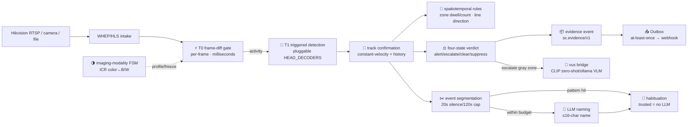

<div align="center">


[English](README.md) · 简体中文 · [Platform design](docs/semantic-camera-design.md) · [Core loop v3](docs/core-loop-v3.md) · [Runtime ER diagram](docs/architecture-er.html)

[](https://github.com/CommitStrip/semantic-camera/actions/workflows/ci.yml)
[](LICENSE)
[](https://github.com/CommitStrip/semantic-camera/tags)
[](https://github.com/CommitStrip/semantic-camera/actions)

**A budget-aware, mode-configurable edge vision event runtime · Turn cameras into auditable semantic event sources**

</div>

---

semantic-camera turns a live video stream (Hikvision RTSP / phone camera / local video) into **on-device realtime venue-semantic discrimination and alerting**: frame-difference gating → triggered detection → track confirmation → four-state fully-automatic verdicts → event segmentation → LLM naming → habituation. All inference runs in-browser as wasm (**video never leaves the device**), and everything produced is a **machine-auditable semantic event**, not raw video. This repo is the mainline of the library family: `vus` is the general video-understanding engine, `rvs` the robotics increment, and the predecessor `anti-drone-monitor` (single-scene anti-drone demo) is frozen while this repo carries the evolution forward.

## ✨ Key features

- **Four-tier speed stack** — T0 frame-difference gating (per-frame, milliseconds) → T1 triggered detection (400ms on motion / 5s patrol on stillness) → track confirmation (constant-velocity prediction + tiered aging, hovering targets never lost) → T1.5 edge discrimination. Expensive inference only for moments that deserve it.
- **Four-state fully-automatic verdicts** — `alert` / `escalate` (gray zones **abstain, never fabricate**) / `clear` / `suppress`; discriminated and detector-authority paths keep separate gates (no missed alerts), and **no step of the pipeline depends on human judgment**.
- **Venue mode packs** — detection model + discrimination head + rules + arming schedule + budgets are all **pure data** (`web/mode-packs.js`); switching venues changes zero core code; `validatePack` is fail-closed (bad configs refuse to arm) and **unknown modes never silently fall back**.
- **Imaging-modality state machine** — multi-signal voting (2of3) for the frame-level IR-CUT color↔B/W switch + oscillation debounce + per-modality parameter profiles + learning freeze in transition windows; synthetic replay meets all four metric targets.
- **Spatiotemporal rule engine** — polygon zones (enter + dwell + occupancy count) and trip lines (direction-filtered crossings + cooldown): rules are pure pack data with a read-only overlay.
- **Scene auto-recognition** — starting without a mode = observation mode (records only, never fabricates); the first confirmed trigger has the slow brain identify the venue, auto-arming at conf≥0.85; **manual assignment always wins**.
- **Event segmentation & LLM naming** — the fast system slices the stream into event time windows (busy scenes force-split at the cap), and the slow brain names them semantically under budget (30/hour); bridge down or budget exhausted → automatic template-name fallback, the event stream stays readable forever.
- **Habituation learning** — recurring event patterns (the daily commute shot) progress draft → model-verified → human-verified; trusted hits **self-name without calling the LLM**, amortizing slow-brain cost over time; 5% audit sampling + admin golden labels + deviation detection prevent "habitual blind spots".
- **Auditable evidence events** — `sc.evidence/v1`: stable event IDs, dual timestamps, config fingerprints, model sha256, detector/discriminator confidences kept separate, pre-roll frame ring + crop frame with content hash.
- **Deterministic alert outlet** — Outbox (at-least-once + event_id idempotency + dead-letter retention) → webhook (redacted by default, metadata only).
- **Pluggable detection heads** — the `HEAD_DECODERS` registry: `yolo8head` / `nanodethead` (GFL distribution regression) / `mock` (deterministic timeline); person model NanoDet-Plus (Apache-2.0, validated on real street footage).
- **Hard cost caps** — triggered detection, arbitration 20/hour, naming 30/hour, behavior checks on their own ledger — every cost is capped, never growing linearly with runtime.

## 🚀 Quick start

```bash
git clone https://github.com/CommitStrip/semantic-camera.git
cd semantic-camera
bash scripts/sync-web.sh                 # stage assets (models/runtime) → web/ (once after clone)

cd web && python3 -m http.server 8899
# open http://localhost:8899/index.html in a browser
```

- **Mode selection**: `?mode=airfield` (anti-drone) / `?mode=restricted-area` (NanoDet person detection + night arming + zone rules); **no mode = scene auto-recognition** (observation mode records only, auto-arms once the bridge identifies the venue).
- **Input sources**: ▶ Start (phone camera) / 📁 Video (local playback) / 🔌 Hikvision (RTSP→WHEP gateway; Basic or query-param auth auto-adapts).
- **Record**: the telemetry panel accumulates live; CSV/JSON export contains the full detection→verdict→arbitration→naming chain.

<details>
<summary>🔌 Slow-brain arbitration bridge (optional): LLM segment naming & behavior checks</summary>

Gray-zone cases escalate to a local slow brain (off by default):

```bash
pip install -r bridge/requirements.txt
cp bridge/config.example.json bridge/config.json   # set token and arbiter (clip zero-shot / ollama VLM)
python bridge/server.py --config bridge/config.json
# in the page, fill ws://<IP>:8390 + token under "桥" → Connect
```

- **Naming**: event segments → LLM semantic naming ("employee badges in for work"); template name r1 ships first, the LLM overwrites as r2 (immutable revisions);
- **Behavior checks**: admins define open-set dangerous behaviors in the pack (fence-climbing / tailgating / vehicle accidents … = data, not code); zone hits trigger mid-segment checks (P95 ≤15s);
- **Budgets**: naming 30/hour + behavior checks on their own ledger (concurrency≤2 / cooldown / queue≤8); bridge down = the edge stays autonomous, never fabricates;
- Every case is archived to JSONL (retraining corpus).

</details>

## 🏗️ How it works



| Tier | Content | Cadence | Purpose |
|------|---------|---------|---------|
| T0 | Frame-diff gate + imaging modality | per-frame | "is anything happening" + picture modality |
| T1 | Triggered detection + tracking | 400ms / 5s patrol | who, where, which trajectory |
| T1.5 | Edge discrimination + rules + verdict | per confirmed target | should this alert |
| T2 | Slow-brain naming & arbitration | per segment (budgeted) | what to call it, gray-zone review |

Two red lines run throughout: **gray zones abstain rather than fabricate, and the detector is authoritative until a verdict exists**; every LLM call goes through a budget (arbitration / naming / behavior-check, three separate ledgers).

## 🏙️ Venue mode packs

| Mode pack | Discrimination task | Value (false-alarm killer) | Status |
|---|---|---|---|
| **airfield anti-drone** | bird / drone (JEPA head) | flocks and drift don't alert; real drones do | ✅ fully shipped |
| **restricted-area intrusion** | person (NanoDet-Plus@416) | night arming + 2s zone dwell escalation + line crossing | ✅ real model + zone rules (7–58 detections/frame on real street footage) |
| **depot smoke/fire** | smoke / fog·sunset | smoke false alarms are the industry's #1 pain | M3 |
| **site PPE compliance** | helmet / no-helmet | person detection alone cannot tell | M3 |
| **campus perimeter** | person / shadow·objects | low-light false-alarm suppression | M3 |
| **farm deterrence** | bird / animal / human | species decides the deterrence action | M5 |

A new venue = one entry in `web/mode-packs.js` (+ optional model/head files), **zero core changes** — enforced by the CI two-mode end-to-end acceptance and source-cleanliness tests.

## 📊 Benchmarks

All numbers below are measured; reproduction scripts live in `scripts/`.

### Person model — real street footage (NanoDet-Plus-m-1.5x@416, Apache-2.0)

| Metric | Result |
|------|------|
| Real street detections | **7–58 persons/frame** (conf>0.4) on sampled frames of a CC BY-SA 4.0 Shibuya crossing video |
| Detection latency | **23–24ms/frame** (Python ORT CPU, 416×416) |
| JS decoder equivalence | matches the numpy reference per-confidence (0.676) |

### Imaging-modality FSM — synthetic ICR replay (image-domain synthesis; real footage pending)

| Metric | Result (target) |
|------|------|
| False triggers (out-of-boundary begins) | **0** (target 0) |
| Missed boundaries | **0** (2 suppressed-in-OSCILlation listed separately by design) |
| Detection latency / settle time | **1.0s / 2.5s** (500ms virtual sampling) |
| Transition-window fake motion | soft-reset coverage 100% of begins |

### Protocols & links

| Item | Result |
|------|------|
| WHEP signaling end-to-end | ✅ MediaMTX v1.20.0 + H.264 (OPTIONS→POST→PATCH→DELETE all pass); live family-gateway probe succeeded |
| Segment naming / behavior-check protocols | ✅ two round-trip E2E tests (clip arbiter abstains honestly); ollama naming parse chain mock-verified (undecidable / JSON extraction / abstain) |
| Probe-head offline accuracy (airfield head) | ✅ 98.15% (162 samples, inherited from the predecessor) |

<details>
<summary>📖 Honest notes & pending items</summary>

- The ICR replay material is **synthetic** (real daytime frames + image-domain B/W-noise transform) — not real IR-CUT camera output; must be re-verified with real footage;
- Browser wasm end-to-end fps/latency **pending** (telemetry already samples per frame — export is the measurement);
- Live ollama naming on-device pending a local ollama + vision model;
- Real dangerous-behavior judgment quality depends on real venue data — ongoing;
- Audit disagreement rate (<5%) and the LLM-call decay curve need deployment data.

</details>

## 📁 Repository layout

```
web/                       browser core (opens directly in modern browsers; domain-free)
  index.html               pipeline wiring + UI (detection/verdict/segmentation/naming/bridge/outlet)
  core.js                  pure-logic core (validation/tracking/gating/verdict/queues/head registry/
                           zone & rule engines/pattern library/naming gate/label chain/evidence/bridge link)
  mode-packs.js            venue mode-pack registry (pure data; the only home of domain terms)
  whep-client.js           WHEP player (Basic/query-param auth adaptive + exponential backoff)
assets/                    model/runtime single source (manifest.json with sha256/license/source)
bridge/                    vus slow-brain arbitration bridge (WS server + CLIP zero-shot/ollama arbiters
                           + scene identify/segment naming/behavior checks + case archive JSONL)
gateway/                   MediaMTX gateway (Hikvision RTSP → WHEP/HLS)
scripts/                   staging/asset integrity/quantization/ICR synthetic replay/family-gateway check
docs/                      platform design (v2.6) / core loop (v3.5) / model selection / logo / ER diagram
tests/                     99 node:test cases (zero deps)
```

## 🤖 Agent consumption

Everything produced is machine-consumable: **evidence events** (`sc.evidence/v1`) and **named segments** (`sc.segment-label/v1`) are published via Outbox/webhook with stable IDs + immutable revisions for idempotent merging by agents; bridge-side MCP-style collaboration (query events / fetch evidence / file tickets) is an optional outlet adapter. Runtime entity relations in [docs/architecture-er.html](docs/architecture-er.html).

## 💻 Hardware footprint

No GPU dependency — all inference is wasm CPU. Python-side selection measurements: NanoDet 23–24ms/frame (desktop CPU); wasm-side is seconds-level — hence detection is **trigger-based** (gate + cooldown), not per-frame. int8 quantization verdict (predecessor repo): the current opset12 export collapses to zero detections when quantized — needs a modern-opset re-export; the validation tool ships with a task-level gate against silent failure.

## 🙏 Acknowledgments

- [NanoDet-Plus](https://github.com/RangiLyu/nanodet) (Apache-2.0) — person detection model (`person-detector.onnx` is the official COCO-pretrained export; selection and elimination evidence in [docs/model-selection.md](docs/model-selection.md)).
- [onnxruntime-web](https://github.com/microsoft/onnxruntime) — wasm inference engine (MIT).
- [MediaMTX](https://github.com/bluenviron/mediamtx) — RTSP → WebRTC/HLS streaming gateway (MIT). This repo only ships configuration and a launch script under `gateway/`.
- [hls.js](https://github.com/video-dev/hls.js) — HLS fallback playback (Apache-2.0).
- [DINOv2](https://github.com/facebookresearch/dinov2) ViT-S/14 (Meta AI) — discrimination feature extractor; upstream code Apache-2.0, official weights CC-BY-NC 4.0 (non-commercial). `dinov2_vits14_feat.onnx` in this repo is an export of its vision tower; verify upstream terms before redistribution or commercial use.
- [YOLOv8 / ultralytics](https://github.com/ultralytics/ultralytics) — detection architecture (AGPL-3.0). `yolov8s-drone.onnx` in this repo is a fine-tuned drone-detection export of that architecture; redistribution and commercial use must comply with AGPL-3.0 and upstream terms.

## License

MIT © 2026 (applies to the repository code; the bundled model weights `*.onnx` follow their upstream licenses — see Acknowledgments)
